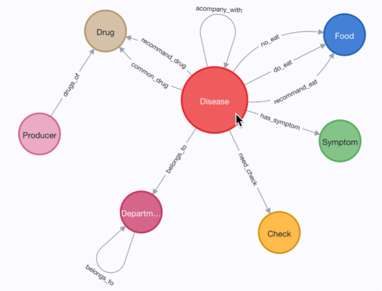
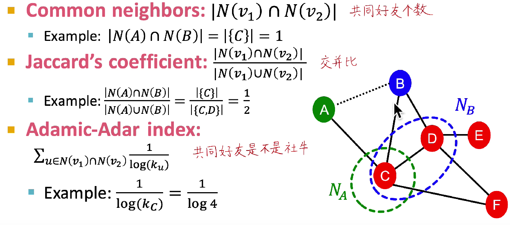
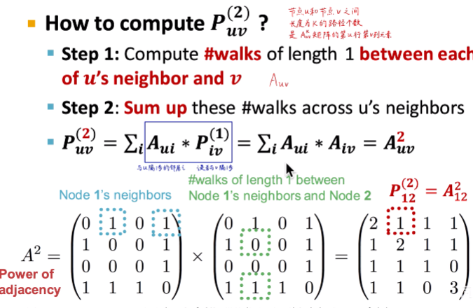
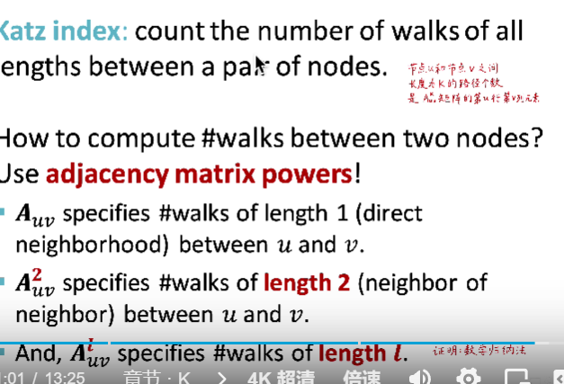
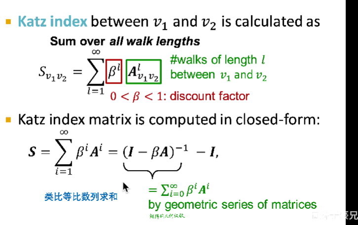
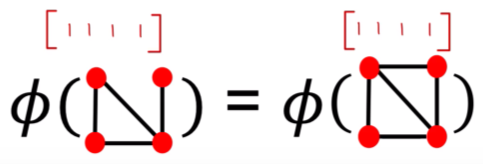
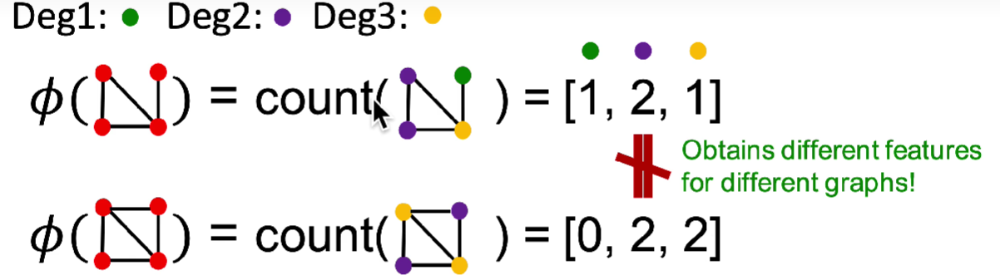
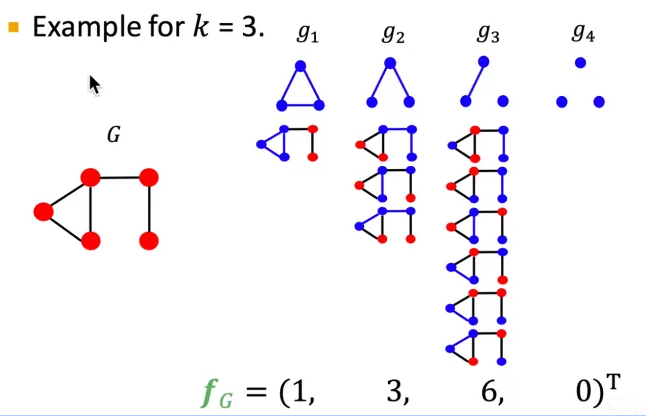
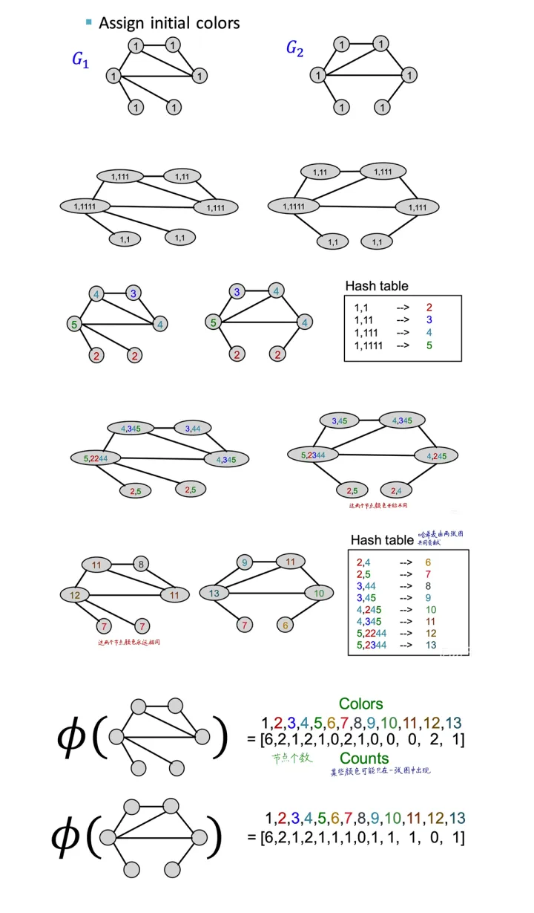

# task02 图的基本表示和特征工程

## 一、基本表示

### 1.1、图的基本表示

**节点（N）**： nodes vertices

**边（E）**： links，edges

**图：G（N，E）**：network，graph

### 1.2 本体图（Ontology）

- 取决于将来想解决的问题
- 需要提前设计好节点的类型，以及节点之间存在的连关系

### 1.3 图的种类

有向图：连接是有方向的

无向图：连接是无方向的

异质图：节点存在不同的类型，连接也存在不同的类型，如讲到的红楼梦知识图谱

二分图：

## 二、节点特征工程

## 三、连接层次的特征工程

通过已知连接，补全未知连接

- 方案

  - 直接提取link的特征，把link变成D维向量

  - 把link两端的节点的D维向量拼在一起（丢失link本身的连接结构信息）

### 3.1、**Two formulation**

- 不随时间变化（客观静态图，如蛋白质，分子）：随机删掉一部分连接，然后把它们预测出来（半监督学习）
- 随时间变化（如论文引用，社交网络）：用上一个时间区段(或时刻)的图，去预测下一个时间区段（或时刻）的图的L个连接，选出，Top n个连接，然后与真实的n个连接进行比较。
  - 提取连接特征——》D维向量——》评估分数——》排序——》选出top n——》与真实值比较进行评估

### 3.2、连接特征分类

#### 1、基于两节点距离（Distance-based feature）

- 只看最短路径长度，忽略个数

#### 2、基于两节点局部信息（Local neighborhood overlap）

|

limitation：两个节点没有共同好友，它们仍然可能是相连的

#### 3、基于两节点在全图的连接信息（Global neighborhood overlap）

- **Katz index** 

  - 节点u和节点v之间长度为k的路径个数
  - 通过邻接矩阵的幂进行运算$P^{(K)}=A^{k}$

  

  

  $S_{v_1v_2} = $

## 四、全图层次的特征工程

提取出的特征应反映全图结构特点

### 4.1、Bag of  Words思想

一篇文章的每个词列出来，计算每个词出现的次数

- Bag of node：只看第i个node有没有，不看连接结构

  - 

- Bag of node degree 只看Node Degree个数，不看节点和连接结构

  - 

- **Graphlet Features**：计算全图中Graphlets的个数

  - $(f_{G})_i$=#($g_{i}$⊆G) for i =1,2,⋯ ,$n_k$表示第*i*个Graphlet在全图中的个数

  - 可以存在孤立的节点；计数全图Graphlet个数，而非特定节点邻域Graphlet个数

  - 

    

**Graphlet Kernel**

- $K(G,G')=f_{G}^{T}f_{G'}$ 两个Graphlet count vector数量积（标量），如果两个图size不一样时，需要进行归一化

- 不常用的原因是，需要进行子图匹配，复杂度高，是np难问题。

### 4.2、**Weisfeiler-Lehman Kernel**

使用颜色微调的方法（Color refinement），迭代地丰富“节点词库”

- 先给每个节点分配统一的颜色

- 把每个节点的颜色，以及它周围节点的颜色，进行哈希，编码成一个编号补充到词汇表中，数全图中有多少这样的编号
  - $c^{(k+1)}(v)=HASH(\{c^{(k)}(v),{c^{(k)}(u)}_{u∈N(v)}\})$
- 重复K步，表示$c^{(K)}(v)$表示 K-hop 的连接

计算十分高效，线性复杂度，只关注非零元素

**Kernel methods**

- 使用kernel代表图的结构而不是feature vectors
- $K(G,G')=ϕ(G)^{T}ϕ(G')$ 两个向量的数量积（标量）
- 一旦kernel一定，现成的机器学习库（如SVM）就可以使用

下面是Weisfeiler-Lehman Kernel的计算过程

